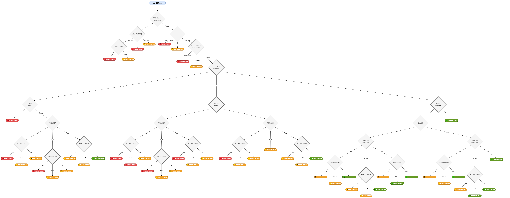

# Knowledge Based System Project – Risiko Gagal Studi Mahasiswa

## Anggota Kelompok
- Ivan Roberto Halim - 71230986
- Paulus Ungirwalu - 71231017

## Metode
- Representasi pengetahuan: **Rule-based (IF–THEN)**
- Metode inferensi: **Forward Chaining**
- Mekanisme eksekusi: **First-Hit Priority**

## Decision-Tree

## Dataset
Dataset yang digunakan merupakan data mahasiswa Informatika UKDW angkatan 2020–2021.

Total data: **55 mahasiswa**

## Kategori Risiko
Sistem mengklasifikasikan mahasiswa ke dalam 3 kategori:
- Risiko Tinggi
- Risiko Sedang
- Risiko Rendah

## Hasil
Distribusi hasil klasifikasi:
- Risiko Tinggi: 2 mahasiswa  
- Risiko Sedang: 17 mahasiswa  
- Risiko Rendah: 36 mahasiswa  

**Catatan:**  
Distribusi ini dihasilkan tanpa mempertimbangkan sanksi akademik dan status administrasi keuangan (diasumsikan “Tidak Ada”).
